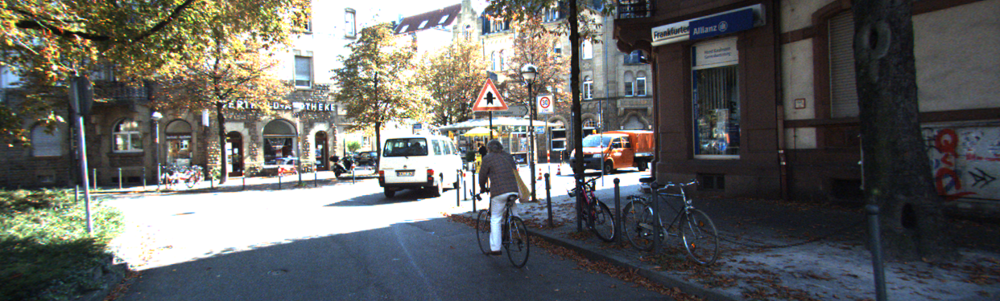
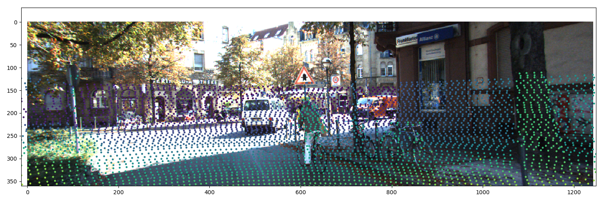
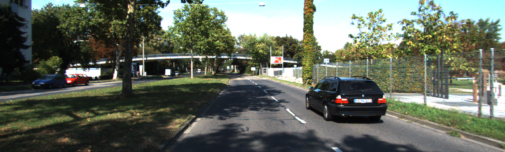
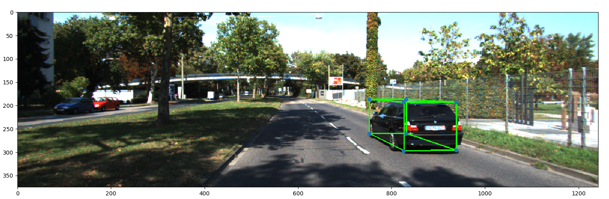
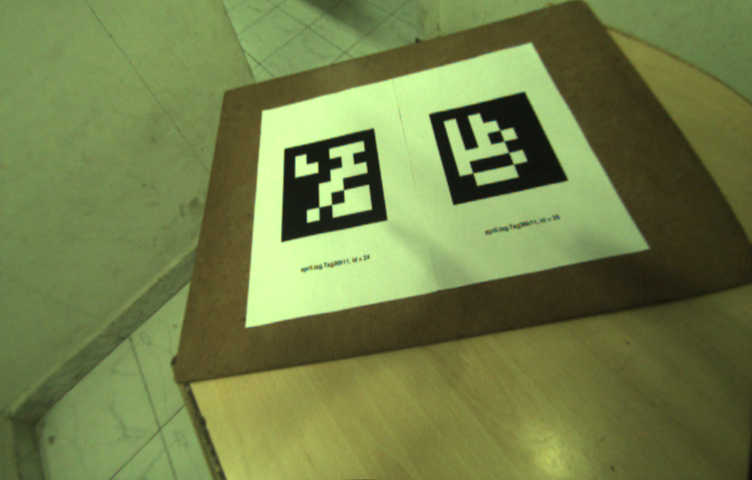
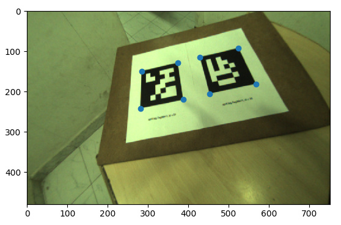

# Mobile Robotics Assignments Moonsoon 2k19

## This repos contains all the Assignments I did as part of Mobile robotics courses guided by Prof K Madhav Krishna

## Assignment 1

### Question 1 given the Lidar points and Camera Image along with the relative Rotation of the camera and with the help of that we have to find out the deapth of the points in the images and scatter the points on image with gradient.

Given Image :

Result Image :

### Question 2 Given the image and Height of the camera, and Dimentions of the car pick one point from the image take it as the world origin and using that make a bounding box around the car.

Given Image :

Result Image :

### Question 3 Given the image coordinates and dimentions of the April tag corners Find the homogeneous matrix and the project the world coordinate points onto the image.

Given Image :

Result Image :
